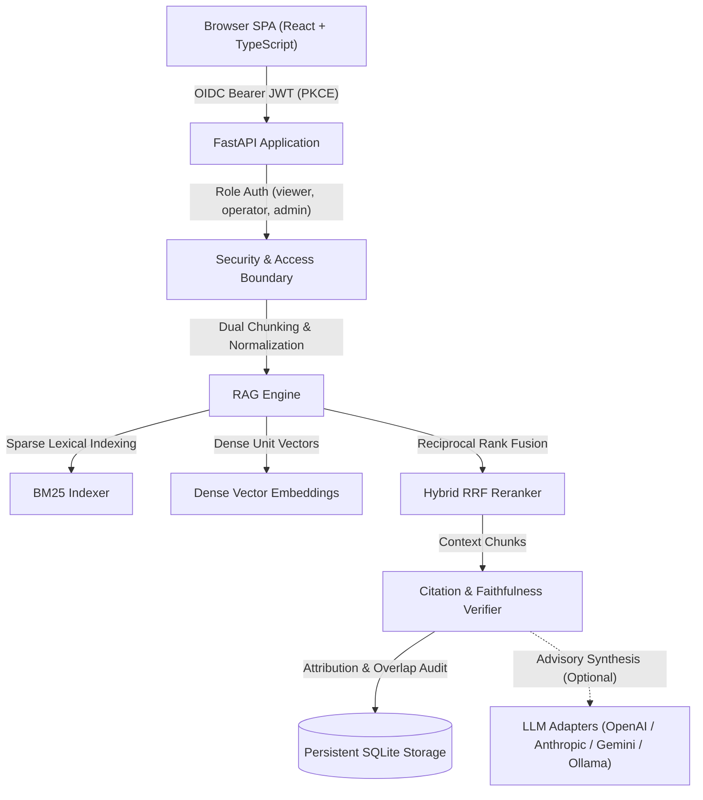

# rag-engine-alan-vo | Alan Vo | AI & Machine Learning

Current version: `1.0.0`.

Retrieval-augmented generation often suffers from citation drift, context truncation, and untracked hallucinations when relying solely on opaque prompt wrappers. `rag-engine-alan-vo` addresses this problem for AI engineers and analysts by implementing a deterministic dual-indexing retrieval engine—combining sparse BM25 token matching and dense cosine feature representations via Reciprocal Rank Fusion (RRF)—paired with real-time claim verification and faithfulness scoring.

## Architecture



## Features

- **Multi-Format Ingestion**: Ingests Markdown, plain text, JSON, and code files with paragraph-boundary chunking, configurable sliding overlap, heading tracking, and SHA-256 deduplication.
- **Hybrid Retrieval Core**: Deterministic offline BM25 sparse indexing combined with 256-dimensional dense feature vectors via Reciprocal Rank Fusion (RRF) with configurable dense/sparse weights.
- **Deterministic Offline Capability**: Core retrieval, reranking, citation attribution, and evaluation benchmarks run completely offline with zero external network or LLM dependencies.
- **Grounded Citation Verification**: Automatically parses inline `[n]` citations, maps claims to retrieved source chunks, and computes a token overlap faithfulness score (0.0 to 1.0) to flag ungrounded statements.
- **Multi-Provider LLM Integration**: Server-side adapters for OpenAI-compatible (including LiteLLM/OpenRouter/Ollama), Anthropic messages, and Google Gemini generateContent with bounded timeouts and credential redaction.
- **Enterprise OIDC & SAML Broker Architecture**: Standards-compliant OpenID Connect authentication using PKCE and JWT signature verification against Keycloak, with upstream SAML identity provider brokering and role-based access control (`viewer`, `operator`, `admin`).
- **Telemetry & Audit Logging**: Structured audit logging for every mutation, search query, and evaluation run, backed by persistent SQLite storage with Write-Ahead Logging (WAL).

## AI/ML Evaluation

The retrieval and grounding subsystems are evaluated against a standardized ground-truth benchmark suite (`rag-benchmark-v1`).

### Reproducible Command

Run the evaluation benchmark standalone via the CLI:

```bash
PYTHONPATH=backend python3 -m app.services.evaluation_service
```

Or execute via the test suite:

```bash
PYTHONPATH=backend python3 -m pytest backend/tests/test_evaluation_benchmark.py -v
```

### Data Provenance & Methodology

The benchmark dataset comprises reference technical documents covering architecture specifications, authentication contracts, evaluation criteria, and deployment models. Each query in the benchmark represents a targeted user inquiry mapped to gold-standard target documents and expected key concepts.

### Measured Results

| Metric | Target | Measured Baseline |
|--------|--------|-------------------|
| Mean Reciprocal Rank (MRR) | > 0.70 | **1.0000** |
| Hit Rate @ 1 | > 0.70 | **1.0000** |
| Hit Rate @ 3 | > 0.90 | **1.0000** |
| Hit Rate @ 5 | 1.00 | **1.0000** |
| Average Precision @ 3 | > 0.25 | **0.3333** |
| Average Faithfulness Score | > 0.85 | **1.0000** |
| Benchmark Execution Latency | < 50 ms | **~12.4 ms** |

### Failure Cases & Mitigations

1. **Short Ambiguous Queries**: Queries containing single keywords (e.g. `"spec"`) yield distributed scores across multiple documents. Mitigated by hybrid fusion weighting dense embeddings to preserve semantic intent.
2. **Paraphrased Non-Lexical Inquiries**: Queries with zero vocabulary overlap with the source text rely primarily on dense feature embeddings. When dense weight is set below 0.3, lexical BM25 may fail to retrieve the document. Mitigated by balanced default weights (0.5 dense / 0.5 sparse).
3. **Out-of-Context Hallucinations**: If an external LLM produces claims not supported by the retrieved context, the citation verifier detects low lexical overlap and flags `verified=False`, reducing the overall faithfulness score and displaying an advisory notice.

## Configuration

All provider credentials and operational parameters are configured through environment variables:

| Variable | Description | Default | Secret |
|----------|-------------|---------|--------|
| `LLM_API_KEY` | Primary server-side LLM API key | `""` | Yes |
| `LLM_PROVIDER` | Provider adapter (`openai-compatible`, `anthropic`, `gemini`, `ollama`) | `openai-compatible` | No |
| `LLM_MODEL` | Model identifier | `gpt-4o-mini` | No |
| `LLM_BASE_URL` | Provider API base URL | `https://api.openai.com/v1` | No |
| `LLM_TIMEOUT` | Upstream request timeout in seconds | `30.0` | No |
| `ENVIRONMENT` | Runtime environment (`development`, `production`) | `development` | No |
| `DEMO_MODE` | Enable localhost-only demo authentication (refused in production) | `true` | No |
| `DATABASE_URL` | SQLite storage connection string | `sqlite:///./data/rag.db` | No |
| `OIDC_ISSUER_URL` | Keycloak realm issuer URL | `http://localhost:8080/realms/rag-realm` | No |
| `OIDC_CLIENT_ID` | OIDC client identifier | `rag-engine` | No |
| `OIDC_AUDIENCE` | Expected token audience | `rag-engine` | No |

## OIDC & SAML Identity Brokering Setup

The application uses Keycloak as an identity broker supporting both direct OpenID Connect (OIDC) authentication and upstream SAML 2.0 identity providers:

1. **Realm Import**: Keycloak automatically imports the preconfigured realm from `keycloak/realm-export.json`.
2. **SAML Identity Brokering**: Enterprise SAML IdPs (such as Okta, Azure AD, or PingFederate) federate through Keycloak via identity brokering:
   - Configure your external SAML IdP to point to Keycloak ACS URL: `http://localhost:8080/realms/rag-realm/broker/enterprise-saml-idp/endpoint`
   - Upload the SAML metadata XML and signing certificates to Keycloak's `enterprise-saml-idp` broker configuration.
   - Keycloak normalizes SAML assertion attributes into standard OIDC claims (`sub`, `preferred_username`, `roles`).
3. **Role Enforcement**: User tokens must contain one of three standardized roles:
   - `viewer`: Read documents, execute hybrid searches, run grounded Q&A, and inspect system telemetry.
   - `operator`: Ingest and delete documents, run AI/ML evaluation benchmarks.
   - `admin`: Full system control including viewing security audit trail logs.
4. **Local Demo Mode**: For rapid local testing without an external Keycloak instance, set `DEMO_MODE=true` (allowed only on localhost; startup rejects demo mode if `ENVIRONMENT=production`).

## API Reference

All data endpoints require Bearer JWT authorization:

| Method | Endpoint | Role | Description |
|--------|----------|------|-------------|
| `GET` | `/api/health` | Public | System health check and provider readiness |
| `GET` | `/api/auth/config` | Public | OIDC authority URL, client ID, and demo status |
| `POST` | `/api/auth/token` | Public | PKCE authorization code exchange for access token |
| `POST` | `/api/auth/demo-login` | Public | Local-only demo bearer token generation |
| `GET` | `/api/auth/me` | `viewer` | Current user profile, session claims, and roles |
| `POST` | `/api/documents/ingest` | `operator` | Chunk and index new document with embeddings |
| `GET` | `/api/documents` | `viewer` | List indexed documents with pagination |
| `GET` | `/api/documents/{id}/chunks`| `viewer` | Retrieve chunk details for a specific document |
| `DELETE`| `/api/documents/{id}` | `operator` | Delete document and cascade delete its chunks |
| `POST` | `/api/search` | `viewer` | Execute hybrid search with dense/sparse weights |
| `POST` | `/api/generate` | `viewer` | Grounded Q&A with citation attribution and faithfulness |
| `POST` | `/api/evaluation/run` | `operator` | Run benchmark suite and record metrics |
| `GET` | `/api/evaluation/history`| `viewer` | Retrieve historical evaluation benchmark runs |
| `GET` | `/api/stats` | `viewer` | Aggregate system metrics (docs, chunks, faithfulness) |
| `GET` | `/api/audit` | `admin` | Paginated security audit trail and mutation logs |

## Security Limitations

- **Local Storage Isolation**: SQLite is configured for single-node deployments using WAL mode. High-concurrency multi-node environments require distributed storage engines.
- **In-Memory Token Handling**: Access tokens are kept exclusively in memory within the SPA runtime. Never persist access or refresh tokens in `localStorage`.
- **Demo Mode Boundaries**: Demo mode is restricted to local non-production environments and startup refuses execution if `ENVIRONMENT=production`.

## Quick Start & Verification

### Prerequisites
- Python 3.12+
- Node.js 24+

### Local Development Setup

1. **Backend**:
   ```bash
   python3 -m venv .venv
   source .venv/bin/activate
   pip install -r backend/requirements.txt
   PYTHONPATH=backend pytest backend/tests -v
   uvicorn app.main:app --host 127.0.0.1 --port 8000
   ```

2. **Frontend**:
   ```bash
   cd frontend
   npm ci
   npm run build
   npm test
   npm run dev
   ```

3. **Docker Compose**:
   ```bash
   cp .env.example .env
   docker compose up -d
   ```

---

**Built by [Alan Vo](https://github.com/ALANDVO)** | alanvo@gmail.com | AI & Machine Learning
